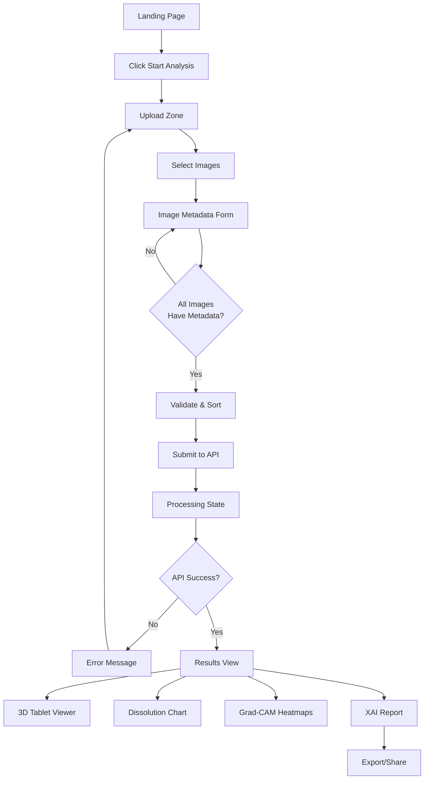

# Tablet Image Analyzer - Architecture Plan

## 🎯 Project Overview

**Purpose:** AI-powered pharmaceutical tablet dissolution analysis platform using Surface Dissolution Imaging (SDi2) with CNN and Grad-CAM explainability.

**Tech Stack:**
- React 19 + Vite
- Three.js (3D visualization)
- Tailwind CSS (styling)
- Zustand (state management)
- Axios (API client)
- Recharts (data visualization)
- React Router (navigation)

**Research Foundation:** Based on MDPI paper - "Explainable AI in Pharmaceutics: Grad-CAM Analysis of Surface Dissolution Imaging Using Convolutional Neural Networks"

---

## 📁 Project Structure

```
tablet-analyzer/
├── public/
│   ├── favicon.svg
│   └── icons.svg
├── src/
│   ├── components/
│   │   ├── common/
│   │   │   ├── ThemeToggle.jsx
│   │   │   ├── Button.jsx
│   │   │   ├── Card.jsx
│   │   │   ├── Badge.jsx
│   │   │   ├── Spinner.jsx
│   │   │   └── ErrorBoundary.jsx
│   │   ├── layout/
│   │   │   ├── Header.jsx
│   │   │   ├── Footer.jsx
│   │   │   └── BottomBar.jsx
│   │   ├── landing/
│   │   │   ├── Landing.jsx
│   │   │   ├── Hero.jsx
│   │   │   ├── Features.jsx
│   │   │   └── Stats.jsx
│   │   ├── upload/
│   │   │   ├── UploadZone.jsx
│   │   │   ├── FilePreview.jsx
│   │   │   ├── ImageMetadataForm.jsx
│   │   │   └── UploadStepper.jsx
│   │   ├── analysis/
│   │   │   ├── TabletViewer.jsx (Three.js)
│   │   │   ├── DissolutionChart.jsx (Recharts)
│   │   │   ├── GradCAMVisualization.jsx
│   │   │   ├── MetricsCard.jsx
│   │   │   ├── TimeScrubber.jsx
│   │   │   └── XAIReport.jsx
│   │   └── results/
│   │       ├── ResultsView.jsx
│   │       ├── ResultsHeader.jsx
│   │       └── ExportPanel.jsx
│   ├── context/
│   │   └── ThemeContext.jsx
│   ├── hooks/
│   │   ├── useUpload.js
│   │   ├── useAnalysis.js
│   │   ├── useTheme.js
│   │   └── use3DTexture.js
│   ├── services/
│   │   ├── api.js (Axios client)
│   │   └── modelService.js (API methods)
│   ├── store/
│   │   └── analysisStore.js (Zustand)
│   ├── utils/
│   │   ├── validation.js
│   │   ├── imageProcessing.js
│   │   ├── formatters.js
│   │   └── constants.js
│   ├── styles/
│   │   └── theme.css
│   ├── App.jsx
│   ├── main.jsx
│   └── index.css
├── .env.local
├── .env.production
├── tailwind.config.js
├── vite.config.js
└── package.json
```

---

## 🎨 Design System

### Color Palette (Light Mode)
```javascript
Primary (Scientific Blue):
- 50: #f0f7ff   (Background very light)
- 500: #0ea5e9  (Main accents)
- 600: #0284c7  (Primary CTAs)
- 900: #0c3d66  (Dark text)

Secondary (Health Green):
- 500: #22c55e  (Success indicators)
- 600: #16a34a  (Success hover)

Accent (Data Orange):
- 500: #f97316  (Data highlighting)

Neutral (Professional Gray):
- 50: #fafafa   (Main background)
- 700: #374151  (Primary text)
- 900: #111827  (Black text)
```

### Dark Mode
```javascript
Background: #0f172a (Slate-950)
Text: #f1f5f9 (Slate-100)
Borders: #334155 (Slate-700)
Primary: #3b82f6 (Lighter blue for contrast)
```

### Typography
```
H1: 48px | 600 weight | text-primary
H2: 32px | 600 weight | text-primary
H3: 24px | 600 weight | text-primary
Body: 16px | 400 weight | text-primary
Small: 14px | 400 weight | text-secondary
```

---

## 🔄 User Flow



---

## 🗄️ State Management (Zustand)

### Store Structure
```javascript
{
  // Upload State
  uploads: [
    {
      id: string,
      file: File,
      preview: string,
      timePoint: number,
      phLevel: number,
      status: 'pending' | 'uploading' | 'success' | 'error'
    }
  ],
  
  // Processing State
  isProcessing: boolean,
  processingProgress: number,
  
  // Current Analysis
  currentAnalysis: {
    id: string,
    r2: number,
    rmse: number,
    dissolutionCurve: Array<{time: number, q: number}>,
    parameters: {
      api: string,
      excipient: string,
      ph: string
    },
    gradCam280: {
      focusRegion: string,
      mechanism: string,
      intensity: number,
      heatmapUrl: string
    },
    gradCam520: {
      focusRegion: string,
      mechanism: string,
      intensity: number,
      heatmapUrl: string
    }
  },
  
  // Results History
  results: Array<Analysis>,
  
  // Filters
  selectedWavelength: 'both' | '280nm' | '520nm',
  selectedTimePoint: number,
  
  // Actions
  setUploads: (uploads) => void,
  addUpload: (upload) => void,
  updateUpload: (id, data) => void,
  removeUpload: (id) => void,
  setProcessing: (isProcessing) => void,
  setCurrentAnalysis: (analysis) => void,
  addResult: (result) => void,
  clearAll: () => void,
  setSelectedWavelength: (wavelength) => void,
  setSelectedTimePoint: (timePoint) => void
}
```

---

## 🌐 API Integration

### Endpoints

#### 1. Analyze Images
```javascript
POST /api/v1/analyze
Content-Type: multipart/form-data

Request:
{
  images: [File, File, ...],
  metadata: [
    { timePoint: 0, phLevel: 1.2 },
    { timePoint: 30, phLevel: 1.2 },
    ...
  ],
  api: "Acetylsalicylic Acid" (optional),
  excipient: "Lactose" (optional)
}

Response (200):
{
  id: "analysis-123456",
  r2: 0.89,
  rmse: 11.57,
  dissolution_curve: [{time: 0, q: 0.0}, ...],
  parameters: {...},
  grad_cam_280: {...},
  grad_cam_520: {...}
}
```

#### 2. Get Grad-CAM Heatmap
```javascript
GET /api/v1/heatmap/:analysisId/:wavelength
Response: Image (PNG/JPEG)
```

#### 3. Export Report
```javascript
POST /api/v1/export
Request: { analysisId: string, format: 'pdf' | 'json' }
Response: File download
```

### Error Handling
```javascript
422 Unprocessable Entity: Invalid image format/size
408 Timeout: Analysis took >30s
500 Server Error: Backend failure
```

---

## 🎮 Key Components

### 1. UploadZone Component
**Purpose:** Drag-drop file upload with validation

**Features:**
- Multi-file selection
- Drag-and-drop support
- File type validation (JPG, PNG only)
- File size validation (<10MB per image)
- Image preview thumbnails
- Progress tracking

**Props:**
```javascript
{
  onFilesSelected: (files: File[]) => void,
  maxFiles: number,
  maxFileSize: number
}
```

### 2. ImageMetadataForm Component
**Purpose:** Capture time point and pH for each image

**Features:**
- Time point input (minutes)
- pH level slider/dropdown (1.2 to 7.4)
- Validation (required fields)
- Chronological sorting
- Visual feedback

**Props:**
```javascript
{
  image: File,
  onSubmit: (metadata: {timePoint: number, phLevel: number}) => void,
  onSkip: () => void
}
```

### 3. TabletViewer Component (Three.js)
**Purpose:** 3D visualization of tablet with heatmap texture

**Features:**
- Chamfered cylinder geometry
- Clinical white material (PBR)
- Dynamic texture mapping (Grad-CAM heatmaps)
- Orbit controls (rotate, zoom, pan)
- Lighting setup (ambient + directional)
- Responsive canvas

**Implementation:**
```javascript
- Geometry: CylinderGeometry with chamfered edges
- Material: MeshStandardMaterial (metalness: 0.1, roughness: 0.4)
- Texture: CanvasTexture from Grad-CAM image
- Controls: OrbitControls
- Lighting: AmbientLight + DirectionalLight
```

### 4. DissolutionChart Component (Recharts)
**Purpose:** Time-series visualization of dissolution profile

**Features:**
- Line chart with time (x-axis) vs % dissolved (y-axis)
- Dark mode support
- Responsive design
- Tooltips with data points
- Grid lines
- Legend

**Data Format:**
```javascript
[
  {time: 0, q: 0.0},
  {time: 5, q: 8.2},
  {time: 10, q: 15.7},
  ...
  {time: 240, q: 96.3}
]
```

### 5. TimeScrubber Component
**Purpose:** Interactive timeline to switch between time points

**Features:**
- Horizontal slider
- Time point markers
- Current time indicator
- Click to jump to time point
- Smooth transitions

**Props:**
```javascript
{
  timePoints: number[],
  currentTime: number,
  onTimeChange: (time: number) => void
}
```

### 6. XAIReport Component
**Purpose:** Explainable AI insights and diagnostics

**Features:**
- Confidence score display
- Erosion diagnostic summary
- Grad-CAM interpretation
- Focus region highlights
- Mechanism explanation

**Data:**
```javascript
{
  confidence: 0.89,
  erosionType: "Surface erosion",
  focusRegions: ["Tablet edges", "Tablet core"],
  mechanisms: ["API surface dissolution", "Matrix erosion"],
  interpretation: "The model identified..."
}
```

---

## 🔧 Custom Hooks

### useUpload Hook
```javascript
const useUpload = () => {
  const [isUploading, setIsUploading] = useState(false);
  const [progress, setProgress] = useState(0);
  const [error, setError] = useState(null);
  
  const uploadImages = async (files, metadata) => {
    // Validate files
    // Create FormData
    // Call API
    // Handle response
  };
  
  return { uploadImages, isUploading, progress, error };
};
```

### useAnalysis Hook
```javascript
const useAnalysis = (analysisId) => {
  const [analysis, setAnalysis] = useState(null);
  const [loading, setLoading] = useState(true);
  const [error, setError] = useState(null);
  
  useEffect(() => {
    // Fetch analysis from API or cache
  }, [analysisId]);
  
  return { analysis, loading, error };
};
```

### use3DTexture Hook
```javascript
const use3DTexture = (heatmapUrl) => {
  const [texture, setTexture] = useState(null);
  
  useEffect(() => {
    // Load image as Three.js texture
    const loader = new THREE.TextureLoader();
    loader.load(heatmapUrl, (loadedTexture) => {
      setTexture(loadedTexture);
    });
  }, [heatmapUrl]);
  
  return texture;
};
```

---

## 🎯 Implementation Phases

### Phase 1: Foundation (Days 1-2)
- Install dependencies
- Configure Tailwind with custom colors
- Set up theme system (light/dark mode)
- Create project structure
- Set up Zustand store

### Phase 2: Upload Flow (Days 3-4)
- Build UploadZone component
- Create ImageMetadataForm
- Implement file validation
- Build upload stepper
- Connect to Zustand store

### Phase 3: API Integration (Day 5)
- Create Axios client
- Build modelService methods
- Implement error handling
- Add loading states
- Test API calls (mock data)

### Phase 4: 3D Visualization (Days 6-7)
- Set up Three.js scene
- Create TabletViewer component
- Implement texture mapping
- Add orbit controls
- Test with sample heatmaps

### Phase 5: Results Dashboard (Days 8-9)
- Build ResultsView layout
- Create DissolutionChart
- Build GradCAMVisualization
- Create MetricsCard components
- Implement TimeScrubber

### Phase 6: XAI & Export (Day 10)
- Build XAIReport component
- Implement export functionality
- Add share features
- Create PDF generation

### Phase 7: Polish & Testing (Days 11-12)
- Add error boundaries
- Implement loading states
- Responsive design
- Dark mode testing
- Performance optimization
- Bug fixes

---

## 🔒 Validation Rules

### Image Upload
```javascript
- File types: JPG, PNG only
- File size: <10MB per image
- Dimensions: ≥224x224 (recommended)
- Batch size: ≤10 images per request
```

### Metadata
```javascript
- Time point: Required, number, ≥0 minutes
- pH level: Required, number, 1.2 to 7.4
- Chronological order: Enforced before submission
```

### API Response
```javascript
- Required fields: r2, rmse, dissolution_curve, grad_cam_280, grad_cam_520
- Number precision: Round to 2 decimal places
- Heatmap URLs: Valid base64 or image path
```

---

## 📊 Performance Targets

- Initial page load: <2s
- Image upload: <5s per image
- API analysis: <30s for batch
- 3D rendering: 60fps
- Chart rendering: <500ms
- Theme switch: <300ms

---

## 🧪 Testing Strategy

### Unit Tests
- Validation functions
- Formatters
- Store actions

### Integration Tests
- Upload flow
- API calls
- State management

### E2E Tests
- Complete workflow: Landing → Upload → Results
- Error scenarios
- Export functionality

---

## 🚀 Deployment

### Environment Variables
```
VITE_API_URL=https://api.pharma-analyzer.com
VITE_API_KEY=prod_key_****
VITE_MODEL_ENDPOINT=/api/v1/analyze
VITE_TIMEOUT=60000
```

### Build Command
```bash
npm run build
```

### Deployment Platforms
- Vercel (recommended)
- Netlify
- AWS Amplify

---

## 📝 Next Steps

1. Review and approve this architecture plan
2. Install dependencies (Phase 1)
3. Set up theme system
4. Begin implementation following the phased approach
5. Test each component incrementally
6. Integrate with backend API
7. Deploy to production

---

**Last Updated:** 2026-05-02
**Version:** 1.0
**Status:** Planning Complete - Ready for Implementation